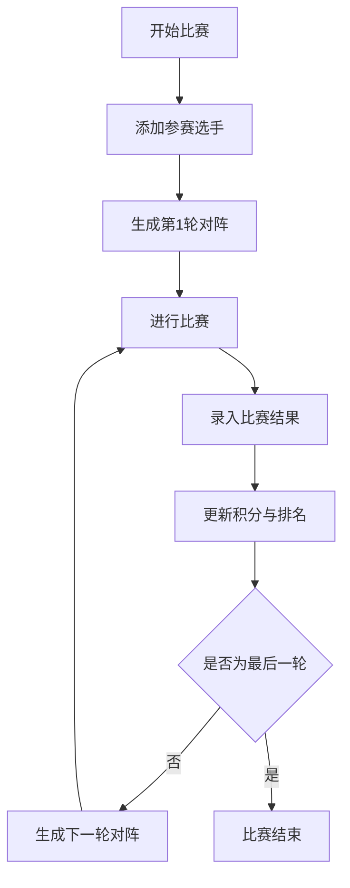

## 1. 产品概述

瑞士轮比赛战绩统计应用，用于管理和统计采用瑞士轮赛制的各类比赛（棋类、卡牌、电子竞技等）。支持选手管理、比赛结果录入、实时战绩统计排名，以及按照瑞士轮规则自动生成下一轮对阵安排。

- **核心价值**：简化瑞士轮比赛组织流程，提供准确高效的配对和统计功能
- **目标用户**：比赛组织者、裁判、参赛选手
- **应用场景**：线下/线上比赛、俱乐部联赛、校园赛事

## 2. 核心功能

### 2.1 用户角色

| 角色 | 注册方式 | 核心权限 |
|------|----------|----------|
| 比赛组织者 | 直接使用 | 创建比赛、管理选手、录入结果、生成对阵 |
| 观众/选手 | 直接使用 | 查看战绩、排名和对阵信息 |

### 2.2 功能模块

1. **选手管理模块**：选手添加/编辑/删除、批量导入
2. **比赛轮次管理**：轮次切换、当前轮次状态、历史轮次回顾
3. **战绩录入模块**：单场比赛结果录入、批量结果导入
4. **统计排名模块**：选手胜率统计、积分排名、小分计算
5. **瑞士轮配对模块**：自动生成下一轮对阵、避免重复对阵、同分配对

### 2.3 页面详情

| 页面名称 | 模块名称 | 功能描述 |
|----------|----------|----------|
| 主页面 | 比赛信息面板 | 显示比赛名称、当前轮次、总轮次、比赛状态 |
| 主页面 | 选手排名列表 | 显示所有选手排名、积分、胜率、胜负场次 |
| 主页面 | 本轮对阵表 | 显示当前轮次所有对阵及结果状态 |
| 主页面 | 操作控制区 | 添加选手、录入结果、生成下一轮对阵按钮 |
| 主页面 | 历史轮次切换 | 切换查看各轮次对阵和结果 |

## 3. 核心流程

### 3.1 比赛组织主流程

比赛组织者首先添加参赛选手信息，然后开始第一轮比赛，系统根据瑞士轮规则生成首轮对阵。比赛结束后录入每局结果，系统自动计算积分和排名。之后每一轮重复"生成对阵→录入结果→更新排名"的流程，直到完成所有轮次。

### 3.2 瑞士轮配对规则

1. 按积分从高到低排序
2. 高分对高分，相邻名次配对
3. 已对阵过的选手不再相遇
4. 如遇无法配对情况，回溯调整
5. 轮空选手得1分（默认）

## 4. 用户界面设计

### 4.1 设计风格

- **主色调**：深靛蓝 (#1e1b4b) 搭配 金色 (#fbbf24) 点缀，营造竞技比赛的庄重感
- **辅助色**：翡翠绿 (#10b981) 表示胜利/完成，玫红 (#f43f5e) 表示失败，灰蓝表示中性状态
- **按钮风格**：圆角矩形，悬浮时有微妙的光影变化和轻微位移
- **字体**：标题使用 Orbitron（科技竞技感），正文使用 Inter，数字等宽字体使用 JetBrains Mono
- **布局风格**：三栏卡片式布局，左侧排名、中间对阵、右侧操作，层次分明
- **视觉元素**：精致的卡片阴影、渐变分割线、微动效交互

### 4.2 页面设计概述

| 页面名称 | 模块名称 | UI元素 |
|----------|----------|--------|
| 主页面 | 顶部标题栏 | 比赛名称大标题、当前轮次徽章、深色主题背景、装饰性几何线条 |
| 主页面 | 选手排名面板 | 排名奖牌图标（金/银/铜）、选手名称、积分条、胜率百分比、胜负场次 |
| 主页面 | 对阵表面板 | 对阵卡片、选手VS布局、结果指示器、轮次标签页切换 |
| 主页面 | 操作面板 | 添加选手表单、录入结果模态框、生成对阵按钮、进度指示器 |

### 4.3 响应式设计

- 桌面端（≥1024px）：三栏布局，排名-对阵-操作并排展示
- 平板端（768-1023px）：两栏布局，排名在上半部分，对阵和操作在下半部分
- 移动端（<768px）：单栏堆叠，通过标签页切换排名和对阵视图

### 4.4 动效设计

- 页面加载：各模块从下往上渐次浮现，带轻微位移
- 排名更新：积分变化时数字滚动动画，排名上升/下降有箭头指示
- 对阵生成：卡片逐个滑入，带错开延迟
- 按钮交互：悬浮时放大1.02倍，阴影加深，点击时有按压效果
