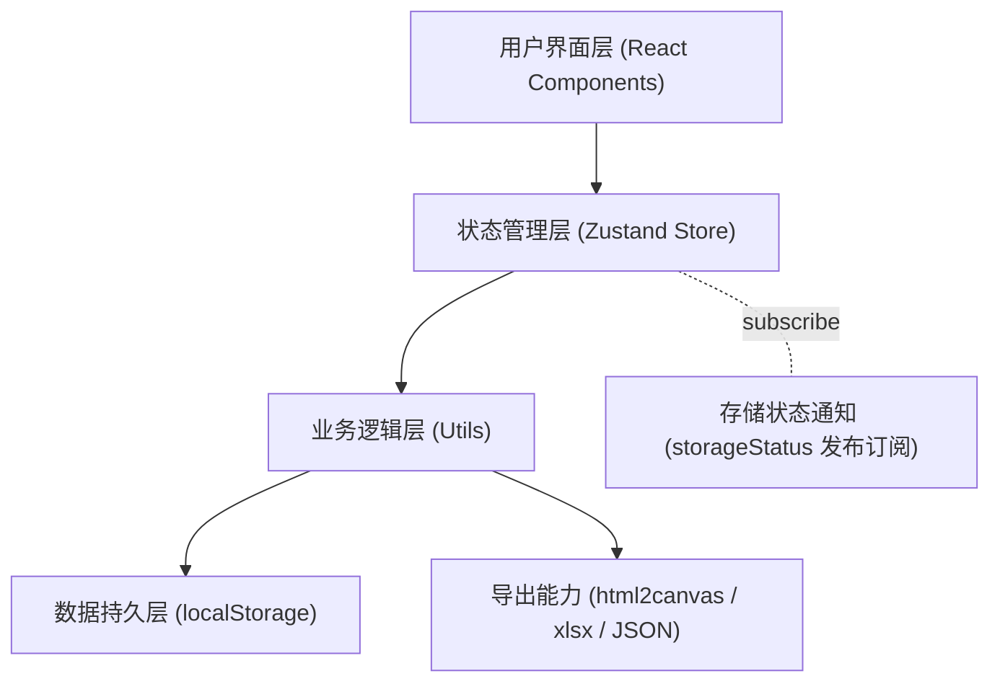
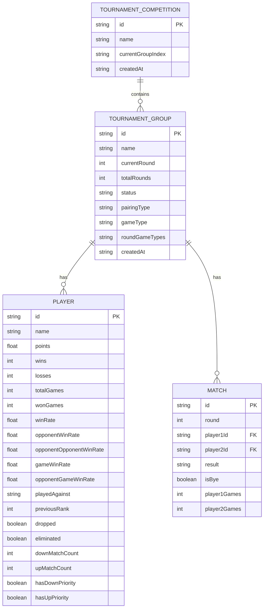

## 1. 架构设计

本应用为纯前端单页应用，所有数据存储在浏览器本地（localStorage），无需后端服务。采用 React + TypeScript 构建，使用 Tailwind CSS 进行样式设计，Zustand 进行全局状态管理。



## 2. 技术描述

- **前端框架**：React 18 + TypeScript
- **构建工具**：Vite 6
- **样式方案**：Tailwind CSS 3（含自定义 gold/indigo/slate 调色板、Orbitron/JetBrains Mono 字体、fade-in-up/slide-in/pulse-glow 动画）
- **状态管理**：Zustand 5（单一 store 管理赛事、当前轮次视图、随机生成进度等）
- **路由**：React Router 7
- **数据持久化**：localStorage（主 key + backup key 双写，带版本化 envelope）
- **图标库**：Lucide React
- **导出能力**：html2canvas（图片）、xlsx（Excel）、原生 Blob 下载（JSON）
- **工具库**：clsx + tailwind-merge（`lib/utils.ts` 中的 `cn`）

## 3. 项目结构

```
src/
├── types/
│   └── index.ts                # 选手、比赛、小组、赛事等类型定义
├── store/
│   └── useTournamentStore.ts   # Zustand 全局状态（赛事/小组/选手/对阵/视图轮次）
├── utils/
│   ├── swissPairing.ts         # 瑞士轮 + 单败淘汰配对算法（核心）
│   ├── ranking.ts              # 排名 / 淘汰头衔 / 比赛历史工具
│   ├── storage.ts              # localStorage 持久化（主备 + 迁移）
│   ├── storageStatus.ts        # 存储状态发布订阅
│   ├── excelExport.ts          # Excel 导出（xlsx）
│   ├── imageExport.ts          # 图片导出（html2canvas）
│   └── fileStorage.ts          # JSON 文件导入/导出
├── components/                 # UI 组件
│   ├── Header.tsx              # 顶部标题栏（赛事名 + 状态徽章）
│   ├── PlayerRanking.tsx       # 选手排名面板
│   ├── MatchList.tsx           # 对阵列表（含编辑/测试模式）
│   ├── ControlPanel.tsx        # 操作控制面板（选手/小组/赛制/导入导出）
│   ├── RoundTabs.tsx           # 轮次切换标签
│   ├── ImageExportModal.tsx    # 图片导出弹窗
│   ├── ExcelExportModal.tsx    # Excel 导出弹窗
│   ├── PlayerPreviewModal.tsx  # 选手预览弹窗
│   ├── HelpPage.tsx            # 帮助说明
│   ├── ConfirmDialog.tsx       # 确认对话框
│   ├── StorageBanner.tsx       # 存储状态横幅
│   ├── MatchImageView.tsx      # 对阵图截图视图
│   ├── RankingImageView.tsx    # 排名图截图视图
│   ├── Empty.tsx               # 空状态
│   └── ErrorBoundary.tsx       # 错误边界
├── hooks/
│   ├── useTheme.ts             # 主题
│   └── useEscapeClose.ts       # ESC 关闭弹窗
├── lib/
│   └── utils.ts                # 通用工具（cn = clsx + tailwind-merge）
├── pages/
│   └── Home.tsx                # 主页面（三栏布局 + 小组切换 + 导出工具栏）
├── App.tsx                     # 路由入口
├── main.tsx                    # 应用入口
└── index.css                   # 全局样式（Tailwind + glass-panel/gold-gradient 等自定义工具类）
```

## 4. 数据模型

### 4.1 三层数据结构

应用采用「赛事 → 小组 → 选手/对阵」三层数据模型，一个赛事可包含多个小组，每个小组独立推进轮次。



### 4.2 类型定义

实际类型定义见 [`src/types/index.ts`](file:///d:/personal/寄存/牌/比赛/比赛战绩统计应用10.0/src/types/index.ts)，核心类型如下：

```typescript
// 比赛结果
type MatchResult = 'player1' | 'player2' | 'draw' | 'pending';

// 赛事状态
type TournamentStatus = 'setup' | 'in_progress' | 'completed';

// 配对赛制
type PairingType = 'swiss' | 'single_elimination';

// 局制
type GameType = 'bo1' | 'bo3' | 'bo5' | 'bo7';

// 选手
interface Player {
  id: string;
  name: string;
  points: number;                  // 积分（胜1 / 平0.5 / 负0 / 轮空1）
  wins: number;
  losses: number;
  totalGames: number;              // 总局数（BO3+）
  wonGames: number;                // 胜局数
  winRate: number;                 // 胜率
  opponentWinRate: number;         // 对手胜率（OMW%）
  opponentOpponentWinRate: number; // 对手对手胜率（OOMW%，BO1 tiebreaker）
  gameWinRate: number;             // 局胜率（GW%，BO3+ tiebreaker）
  opponentGameWinRate: number;     // 对手局胜率（OGW%，BO3+ tiebreaker）
  playedAgainst: string[];         // 已对阵过的选手ID（含 'bye'）
  previousRank?: number;           // 上一轮排名（用于变化指示）
  dropped?: boolean;               // 弃赛
  eliminated?: boolean;            // 被淘汰（单败淘汰）
  downMatchCount?: number;         // 累计向下匹配次数
  upMatchCount?: number;           // 累计向上匹配次数
  hasDownPriority?: boolean;       // 优先向下匹配标记
  hasUpPriority?: boolean;         // 优先向上匹配标记
}

// 对阵
interface Match {
  id: string;
  round: number;
  player1Id: string;
  player2Id: string;               // 'bye' 表示轮空
  result: MatchResult;
  isBye?: boolean;
  player1Games?: number;
  player2Games?: number;
}

// 小组
interface TournamentGroup {
  id: string;
  name: string;
  currentRound: number;
  totalRounds: number;
  status: TournamentStatus;
  players: Player[];
  matches: Match[];
  createdAt: string;
  pairingType: PairingType;
  gameType: GameType;
  roundGameTypes?: GameType[];     // 每轮独立赛制，下标 round-1
}

// 赛事（顶层）
interface TournamentCompetition {
  id: string;
  name: string;
  groups: TournamentGroup[];
  currentGroupIndex: number;
  createdAt: string;
}
```

## 5. 状态管理

### 5.1 Zustand Store

全局状态由 [`src/store/useTournamentStore.ts`](file:///d:/personal/寄存/牌/比赛/比赛战绩统计应用10.0/src/store/useTournamentStore.ts) 单一 store 管理，主要职责：

- **赛事级别操作**：初始化、加载/导入、更新名称、小组增删/切换、批量配置
- **小组级别操作**：选手增删改、弃赛切换、轮次/赛制/局制设置、每轮赛制
- **比赛流程**：开始赛事、生成下一轮（单个/全部小组）、撤回上一轮、录入结果、修改对阵
- **视图状态**：当前查看的轮次（viewRound）、随机生成进度
- **派生数据**：`getRankedPlayers()`、`getMatchesForRound()`、`isCurrentRoundComplete()`

### 5.2 便捷 Hook

```typescript
// 获取当前小组（响应式）
export function useCurrentGroup(): TournamentGroup
```

### 5.3 批量操作优化

随机生成模式下使用「轻量版」纯函数（`generateNextRoundFast` / `applyMatchResultFast`）：
- 仅更新积分与对阵，不重算 winRate / 排名
- 批量结束后通过 `recalculateRanking` 统一重算
- 每步之间 `yieldToMain()` 让出主线程，避免长同步任务阻塞 UI

## 6. 配对算法

配对算法位于 [`src/utils/swissPairing.ts`](file:///d:/personal/寄存/牌/比赛/比赛战绩统计应用10.0/src/utils/swissPairing.ts)，是项目核心。

### 6.1 瑞士轮配对（`generateSwissPairings`）

**第一轮**：随机打乱后两两配对，奇数人数最后一人轮空（计 1 胜）。

**第二轮及以后**：

1. **排序与分组**：按战绩指标排序，所有指标完全相同的选手归入同一战绩组
2. **从最高战绩组向下处理**，每个组依次执行：
   - **步骤 A**：处理上一组留下的下移组
     - A1. 下移组内部优先互相匹配（`matchDownPoolInternal`）
     - A2. 剩余下移组成员与当前组 1V1 匹配，向上匹配对手通过 `selectUpOpponent` 选择
     - 匹配成功：更新双方上下匹配次数与优先级标记
     - 匹配失败：继续下移到下一战绩组
   - **步骤 B**：当前组组内匹配（`matchWithinGroup`）
     - 对折匹配优先（前半 vs 后半，检查无重复对阵）
     - 对折失败 → 组内穷举回溯（`findValidPairingStates`，深度限制 200）
     - 仍失败或人数为奇 → 选一人下移，剩余递归
3. **步骤 C**：所有组处理完后，下移组剩余成员轮空

### 6.2 上下匹配平衡机制

为避免同一选手反复被上下调，每个选手维护：

| 字段 | 含义 |
|------|------|
| `downMatchCount` | 累计向下匹配次数 |
| `upMatchCount` | 累计向上匹配次数 |
| `hasDownPriority` | 优先向下匹配标记（向上匹配后获得，使用后清零） |
| `hasUpPriority` | 优先向上匹配标记（向下匹配后获得，使用后清零） |

**选人规则**：
- **下移组选人**（`selectDownPlayer`）：有 `hasDownPriority` 优先 → `downMatchCount` 最少 → 排名最靠后
- **向上匹配对手**（`selectUpOpponent`）：有 `hasUpPriority` 优先 → `upMatchCount` 最少 → 排名最靠前

### 6.3 单败淘汰制（`generateSingleEliminationPairings`）

- 第一轮：随机配对，奇数轮空
- 后续轮次：取上一轮胜者（含轮空晋级者），两两配对
- 胜者晋级，败者标记 `eliminated = true`
- 奇数晋级者时自动轮空

### 6.4 排名计算（`getRankedPlayers` / `sortPlayersByRank`）

**瑞士轮排序键**（依次比较）：

```
活跃度（活跃 > 被淘汰 > 弃赛）
→ 胜率 winRate
→ 对手胜率 opponentWinRate
→ BO1: 对手对手胜率 opponentOpponentWinRate
  BO3+: 局胜率 gameWinRate → 对手局胜率 opponentGameWinRate
→ 积分 points
→ 姓名（localeCompare）
```

**单败淘汰排序键**：活跃度 → 胜场 → 负场 → 姓名

### 6.5 胜率计算（`calculateAllWinRates`）

- 选手胜率 = wins / (wins + losses)
- 局胜率 = wonGames / totalGames
- 对手胜率 / 对手对手胜率：两轮迭代计算（类似 Buchholz）
  - 第一轮：对手胜率的平均值 → `opponentWinRate`
  - 第二轮：对手的 `opponentWinRate` 平均值 → `opponentOpponentWinRate`
- BO3+ 额外计算 `opponentGameWinRate`

## 7. 数据持久化

持久化层位于 [`src/utils/storage.ts`](file:///d:/personal/寄存/牌/比赛/比赛战绩统计应用10.0/src/utils/storage.ts)。

### 7.1 存储格式

采用版本化 envelope 包装：

```typescript
interface StorageEnvelope {
  version: number;          // 当前 2
  savedAt: string;          // ISO 时间戳，UI 显示"最后保存于..."
  data: TournamentCompetition;
}
```

### 7.2 双 key 主备机制

- 主 key：`swiss_tournament_data`
- 备份 key：`swiss_tournament_data_backup`
- 每次保存双写；主 key 解析失败时自动从备份恢复并写回

### 7.3 格式迁移

`tryParse` 兼容三种历史格式：
1. **Envelope v2**：当前格式
2. **Competition v1**：直接 `{groups, currentGroupIndex, ...}`
3. **LegacyTournament**：单小组旧格式（无 groups，含 players/matches）

`migrateGroupPairingType` 处理字段级迁移：
- 旧 `gameType = 'single_elimination'` → `pairingType = 'single_elimination'` + `gameType = 'bo1'`
- 补齐缺失的 `roundGameTypes`、`pairingType`
- 补齐选手的 `downMatchCount` / `upMatchCount` / `hasDownPriority` / `hasUpPriority`

### 7.4 容量预警

- 阈值：4MB（`STORAGE_WARN_BYTES`）
- 超限通过 `notifyStorageStatus('ok', '...')` 提示用户导出备份
- `QuotaExceededError` 时通过 `notifyStorageStatus('quota_exceeded', '...')` 提示

### 7.5 存储状态通知

`storageStatus.ts` 实现轻量发布订阅，避免 store 与 storage 循环依赖：

```typescript
type StorageStatus = 'ok' | 'quota_exceeded' | 'error';
notifyStorageStatus(status, message);   // 发布
subscribeStorageStatus(listener);        // 订阅（StorageBanner 使用）
```

## 8. 核心功能模块

### 8.1 选手管理（`ControlPanel.tsx`）
- 添加 / 编辑 / 删除单个选手
- 批量导入（文本粘贴，每行一个名字）
- 弃赛标记（`togglePlayerDropped`）
- 选手数量调整（`setPlayerCount`，自动增删默认名选手）
- 跨小组选手预览（`PlayerPreviewModal`）

### 8.2 赛事管理（`ControlPanel.tsx` + store）
- 创建赛事，配置小组数 / 每组选手数 / 每组轮次数 / 局制 / 赛制
- 小组增删 / 重命名 / 切换
- 批量配置所有小组（`batchSetGroupConfig`）
- 每轮独立赛制（`setRoundGameType`）
- 单败淘汰自动计算总轮次（`getSingleEliminationRounds = ceil(log2(n))`）

### 8.3 比赛流程
- 开始赛事（`startTournament` / `startAllGroups`）
- 生成下一轮（`generateNextRound` / `generateNextRoundAllGroups`）
- 录入结果（`updateMatchResult`，支持撤回与重录）
- 撤回上一轮（`undoLastRound`）
- 修改对阵选手（`updateMatchPlayers` / `batchUpdateRoundMatches`）
- 随机生成全部结果（`randomGenerateAllGroups`，测试用）

### 8.4 统计排名（`PlayerRanking.tsx` + `ranking.ts`）
- 实时多级 tiebreaker 排名
- 排名变化指示（`previousRank` 对比）
- 单败淘汰头衔（冠军/亚军/四强/八强/十六强...，`getEliminationTitle`）
- 每轮比赛历史可视化（胜/负/双负/轮空色块）

### 8.5 数据导入导出
- **JSON 文件**（`fileStorage.ts`）：完整赛事数据导入/导出，含格式校验
- **Excel**（`excelExport.ts`）：排名表 / 对阵表，支持导出所有小组
- **图片**（`imageExport.ts` + `RankingImageView` / `MatchImageView`）：html2canvas 截图，支持导出所有小组

### 8.6 UI 辅助
- **错误边界**（`ErrorBoundary.tsx`）：捕获渲染异常
- **存储状态横幅**（`StorageBanner.tsx`）：订阅 `storageStatus`，显示保存状态与最后保存时间
- **确认对话框**（`ConfirmDialog.tsx`）：生成下一轮前展示本轮双负/轮空/弃赛摘要
- **帮助页**（`HelpPage.tsx`）：使用说明
- **ESC 关闭弹窗**（`useEscapeClose`）

## 9. UI 设计

### 9.1 设计风格

- **主色调**：深靛蓝 `#1e1b4b` + 金色 `#fbbf24` 点缀，营造竞技比赛的庄重感
- **辅助色**：翡翠绿 `#10b981`（胜利/完成）、玫红 `#f43f5e`（失败）、灰蓝（中性）
- **字体**：标题 Orbitron（科技竞技感）、正文 Inter、数字 JetBrains Mono
- **自定义工具类**：`glass-panel`（毛玻璃）、`gold-gradient`（金色渐变文字）、`card-glow`（卡片光晕）

### 9.2 布局

主页面（`Home.tsx`）采用响应式三栏布局：

| 断点 | 布局 |
|------|------|
| 桌面端 (xl ≥1280px) | 12 栏网格：排名(3) \| 对阵(6) \| 操作(3) |
| 平板/移动端 | 单栏堆叠，对阵在上、排名在中、操作在下 |

顶部包含：帮助按钮、测试模式按钮、标题栏、小组切换标签、导出工具栏。

### 9.3 动效

通过 Tailwind 自定义 keyframes 实现：
- `fade-in-up`：模块入场
- `slide-in`：对阵卡片滑入
- `pulse-glow`：金色脉冲光晕

## 10. 构建与脚本

| 命令 | 说明 |
|------|------|
| `npm run dev` | 启动 Vite 开发服务器（HMR） |
| `npm run build` | `tsc -b && vite build` 类型检查 + 生产构建 |
| `npm run preview` | 预览生产构建 |
| `npm run check` | `tsc -b --noEmit` 仅类型检查 |
| `npm run lint` | ESLint 检查 |

测试辅助脚本：
- `test-reset.cjs` / `test-reset.mjs`：重置本地存储数据，便于手动测试
