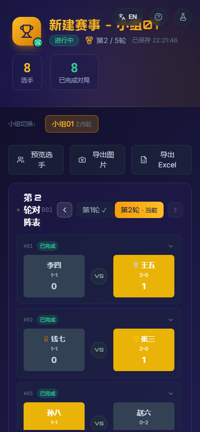

# 诗意 · 比赛战绩统计系统

[English README](./README.en.md)

当前版本：v0.2.4

[](LICENSE)
[](https://yyt43.github.io/match-statistic/)
[](https://github.com/yyt43/match-statistic/releases/tag/v0.2.4)


一个适合小型牌类 / 竞技类赛事的轻量战绩统计与配对工具，帮助你快速完成报名、分组、轮次安排、战绩复盘和排行榜维护。支持多小组并行运行、瑞士轮 / 单败淘汰两种赛制、BO1 / BO3 / BO5 / BO7 局数配置，以及 Excel / 图片 / JSON 多格式导出。

本项目适合比赛管理、俱乐部赛事、团队活动和牌类比赛的日常记录。它使用现代 React + TypeScript 架构，前端可直接部署到 GitHub Pages，便于现场或线上使用，也方便二次定制与扩展。

## 界面预览


<p align="center">
  
</p>

## 项目亮点

- 多小组并行赛事管理：统一管理多个分组、赛制和轮次
- 瑞士轮 / 单败淘汰双赛制：支持常见比赛流程与淘汰结构
- Excel 一键导入：支持文本、CSV、TXT、XLSX 批量导入选手名单
- 多表格工作簿导入：按 sheet 名自动识别小组，批量分组录入
- 赛前弃赛 / 赛后弃赛 / 轮空规则：覆盖日常比赛边界情况
- 操作级撤销 / 重做：最近 30 个赛事操作可逐步回退或恢复
- 单写者保护：多个标签页打开时仅一个可编辑，其余自动只读
- 可配置破分链：支持 BO1 / 多局标准预设及自定义指标顺序
- 快速录分：当前轮集中录分，支持键盘快捷键和自动跳转下一场
- 存储体检：检查主备记录、存储一致性、快照和审计状态并支持修复重写
- 结果导出：Excel、图片、JSON 数据导出，便于复盘和备份
- 公开托管：可直接部署到 GitHub Pages，适合现场、线上和协作使用

## 项目简介

### 源码结构

- `src/components/common`：通用弹窗、页头、错误边界和状态提示
- `src/components/competition`：赛事控制、小组、轮次和加赛
- `src/components/players`：选手管理、预览、弃赛和排行榜
- `src/components/matches`：对阵列表、结果录入和整轮编辑
- `src/components/export`：Excel、图片导出与导出预览
- `src/i18n`：翻译数据、语言上下文和国际化测试
- `src/store/actions`：从主 Store 拆出的赛事生命周期与快照动作
- `src/utils/storage`：IndexedDB、localStorage、快照、跨标签页同步和单写者锁
- `src/utils/export`：Excel、图片和 JSON 导出
- `src/utils/import`：Excel、CSV、TXT 选手导入
- `src/utils/schema.ts`：导入与持久化数据结构校验

### 开放与复用

本项目采用 MIT License，适合公开展示、二次开发与轻量工具复用。该协议简单直接，允许自由使用、修改和分发，同时保留版权说明。

- 许可证文件：[LICENSE](LICENSE)
- 隐私说明：[PRIVACY.md](PRIVACY.md)
- 第三方许可：[THIRD_PARTY_NOTICES.md](THIRD_PARTY_NOTICES.md)
- 适用场景：个人项目、团队协作、工具型开源项目
- 目标：让代码更容易学习、复用和扩展，同时保持清晰的版权记录

- 项目名称：诗意 · 比赛战绩统计系统
- 适用场景：牌类活动、桌游联赛、团体赛、内部竞技赛
- 目标：减少手工记录、统一赛制规则、清晰展示战绩与排名
- 技术栈：React 18 + TypeScript + Vite + Zustand + xlsx
- 发布方式：静态前端，可部署到 GitHub Pages、Vercel、Nginx 等平台

## 开源与协作

- 开源协议：MIT License
- 默认分支：main
- 建议协作流程：feature 分支 -> PR -> review -> merge 到 main
- 问题反馈：通过 GitHub Issues 提交 bug 或需求；敏感安全问题请参考 [SECURITY.md](SECURITY.md)
- 贡献指南：见 [CONTRIBUTING.md](CONTRIBUTING.md)

如果你想参与项目开发，也欢迎提交功能建议、反馈问题或改进方案。

## 参与贡献

欢迎参与改进和扩展本项目。建议在提交前先确认以下事项：

- 先在 Issues 中确认需求或复现步骤，避免重复开发
- 使用 `main` 作为稳定基线，新功能请从 `feature/*` 或 `fix/*` 分支切出
- 遵循现有代码结构和测试规范，必要时补充回归测试
- 提交 PR 前请运行：`npm run check`、`npm run test:coverage`、`npm run smoke`、`npm run visual:check`、`npm run build`
- 若涉及 Excel 导入、赛制规则、排名逻辑，请同步更新文档和测试案例

对于大多数改动，保持简洁、明确、可验证的提交说明会更有利于协作。

## 分支策略

建议采用简洁的分支模型：

- main：稳定主分支，发布前确保 tests / build 全部通过
- develop：可选的开发主线，适合日常集成
- feature/*：新增功能分支，按任务单独开发
- fix/*：修复分支，针对问题修复或回归处理
- hotfix/*：紧急修复分支，优先用于线上修复

如果你希望更轻量，也可以直接使用 `main` + `feature/*` 的方式，适合小型开源项目。

其中，Excel 导入支持文本粘贴、单表名单导入和多表格工作簿导入；当工作簿中存在多个 sheet 时，系统会按表名自动识别为多个小组，并按每个 sheet 的内容分别导入选手名单。

## 目录

- [产品需求文档（PRD）](docs/PRD.md)

- [技术架构](docs/ARCHITECTURE.md)

- [功能特性](#功能特性)

- [Excel 批量录入选手](#excel-批量录入选手)

- [多表格 Excel 导入](#多表格-excel-导入)

- [快速开始](#快速开始)

- [部署到 GitHub Pages](#部署到-github-pages)

- [配对规则](#配对规则)

- [排名规则](#排名规则)

- [轮空 / 赛前弃赛 / 赛后弃赛](#轮空--赛前弃赛--赛后弃赛--行为与胜率影响总览)

- [规则文档](#规则文档)

- [相关链接](#相关链接)

- [免责声明](#免责声明)

- [更新日志](#更新日志)

## 功能特性

### 赛制与局数

- **赛制支持**：瑞士轮（Swiss）+ 单败淘汰（Single Elimination）

- **局数配置**：BO1 / BO3 / BO5 / BO7

- **加赛功能**：比赛结束后若多名选手所有破分指标完全相同，一键生成加赛对阵

### 小组与选手管理

- **多小组管理**：单赛事内可建多个小组（1\~20 个），支持同时开赛与跨小组预览

- **选手整体预览**：比赛开始前可一键预览全部小组的选手名单，自动检测重名与空小组

- **选手名单管理**：支持手动逐个编辑、粘贴多行名单、Excel / CSV / TXT 批量导入；通过「批量设置所有小组」统一配置各组人数、轮次、赛制后一键应用

## Excel 批量录入选手

应用支持三种快速录入方式：

1. 文本粘贴：在「选手管理」中直接粘贴名单，每行一个姓名，或用逗号 / 分号分隔。
2. Excel 批量导入：上传 `.xlsx` / `.xls` / `.csv` / `.txt` 文件，系统会自动识别各 sheet 的表头，并优先读取包含 `姓名` / `Name` / `Player` 等字段的列；若表头不明确，用户也可手动选择需要作为选手名称的列。
3. 多表格 Excel 导入：如果工作簿中含有多个 sheet，每个 sheet 名称会被当作一个小组名，系统会按表名自动拆分成多个小组并批量导入，适合一份 Excel 文件中同时保存多个组别名单。

录入过程会自动去除空白、重复项、表头字段（例如 `姓名` / `name`）以及非姓名列中的数字/备注，避免名单中出现空值和重复选手，适合大规模赛前报名、比赛名单整理和跨表格迁移。

## 多表格 Excel 导入

当 Excel 文件中包含多个工作表时，系统会按表页名称建立对应小组：

- `A组`、`B组`、`C组` 会分别映射为三组小组
- 每个 sheet 内的有效姓名会自动收集并去重
- 若某个 sheet 为空或未识别到姓名，则自动跳过，不会创建空小组
- 若只有一个 sheet，则按传统单组名单导入行为处理

这种方式很适合赛前把不同组别名单分表保存、统一上传、减少重复录入。

### 配对与排名

- **配对算法**：战绩分层（胜场同组）→ 对折匹配 → 穷举回溯 → 三级优先级上下移组 → 残余轮空

- **排名规则**（默认预设，可在赛制设置中切换模板或自定义顺序）：

  - **BO1**：胜场数 → 对手胜率(SOS) → 对手的对手胜率(SOSOS)

  - **BO3 / BO5 / BO7**：胜场数 → 对手胜率(SOS) → 本人局胜率 → 对手局胜率

- **双负（平局）**：BO1 / 多局均支持；单败淘汰中双方同时淘汰

### 弃赛管理

- **赛前弃赛**（对阵级入口）：胜方计入个人胜场；该场不计入对手胜率 / 对手局胜率网络；弃赛者本人不失个人败场；弃赛者自动进入退赛状态

- **赛后弃赛**（选手级入口）：不产生新胜负归属给他人；后续轮次不再配对；已完赛场次冻结，聚合公式按场次少自动降权

- **轮空规则**：轮空视为胜方 1 场有效比赛；对手侧 BYE 作为虚拟对手按 0 胜 / 1 场计入

### 导出与工具

- **导出能力**：Excel（`.xlsx`，成绩总表 + 每轮对阵明细）、选手列表图片、完整赛事 JSON（可再导入）

- **错误边界**：全局 `ErrorBoundary` 包裹，渲染崩溃时显示错误信息 + 重试 + 导出数据按钮，防止白屏丢数据

- **其它**：测试模式一键生成对局结果、Ctrl+Z 撤销上一操作、Ctrl+Shift+Z / Ctrl+Y 重做、预览弹窗滚动优化、移动端响应式、可访问性 aria-label

## 快速开始

```bash
# 安装依赖
npm install

# 本地开发
npm run dev

# 类型检查
npm run check

# 运行测试
npm test

# 运行测试并检查覆盖率门槛
npm run test:coverage

# 浏览器冒烟测试（需要本机 Chrome 或 Edge）
npm run smoke

# 离线 PWA 测试
npm run smoke:offline

# 视觉回归检查
npm run visual:check

# 构建生产版
npm run build
```

构建产物在 `dist/`，可直接部署至任意静态文件服务器（GitHub Pages / Vercel / Nginx 等）。

## 部署到 GitHub Pages

项目已内置 GitHub Pages 发布配置，仓库根目录包含 `.github/workflows/deploy.yml`，会在推送到 `main` 分支时自动构建并部署到 GitHub Pages。

### 本地手动部署

```bash
npm install
npm run build
npm run deploy
```

如果你使用的是公开仓库，并且远程地址为 GitHub，执行完成后可通过以下地址访问：

- `https://yyt43.github.io/match-statistic/`

如果仓库名不同，需同步更新 `package.json` 的 `homepage` 字段以及 `vite.config.ts` 的 `base` 配置。

## 配对规则

瑞士轮配对遵循以下十大规则（完整说明详见应用内「帮助与说明」）：

| 编号 | 规则       | 说明                                      |
| -- | -------- | --------------------------------------- |
| 1  | 第一轮随机    | 所有活跃选手随机洗牌后两两配对，奇数人最后一名轮空               |
| 2  | 不重复对阵    | 任意两人不会重复匹配第二次                           |
| 3  | 选下移人优先级  | ① 向下标记 → ② 向下匹配次数最少 → ③ 排名最靠后           |
| 4  | 选向上对手优先级 | ① 向上标记 → ② 向上匹配次数最少 → ③ 排名最靠前           |
| 5  | 上下标记补偿   | 向下匹配后获向上优先权；向上匹配后获向下优先权；使用后清零           |
| 6  | 二次标记兜底   | 全组均有上下匹配经验时，再赋最末/排头者第二次机会               |
| 7  | 最后轮空     | 最终下移组无法匹配的选手直接轮空                        |
| 8  | 轮空计分     | 轮空比分按赛制自动填充（BO1=1-0, BO3=2-0...），计入所有小分 |
| 9  | 组内三级策略   | ① 对折匹配 → ② 穷举回溯 → ③ 失败下移                |
| 10 | 下移组有序处理  | 优先内部互配 → 再与下战绩组 1V1 → 仍不行进下一组下移池        |

## 排名规则

当多名选手胜场数相同时，按以下默认破分链逐级区分。赛前可在「赛制管理」中选择默认模板，或通过自定义模式调整指标顺序：

### BO1 赛制

```
胜场数 → 对手胜率(SOS) → 对手的对手胜率(SOSOS) → 积分 → 姓名
```

### BO3 / BO5 / BO7 赛制

```
胜场数 → 对手胜率(SOS) → 本人局胜率 → 对手局胜率 → 积分 → 姓名
```

### 加赛规则

当常规比赛结束、所有破分指标仍相同时，每个同分组分别抽签，不再混合配对。加赛允许与常规赛对手再次交手：

- 两人：直接加赛决胜，允许再次交手，不再出现双方都轮空。
- 三人：裁判选择三进一或三进二，抽签一人等候；等候不产生轮空胜场。三进一由首场胜者对等候者，三进二由首场败者对等候者。
- 四人：首轮两两对阵，点击「生成下一阶段加赛」，胜者之间决出第一、二名，败者之间决出第三、四名。
- 超过四人：不自动编造赛制，提示裁判依据手册补充规则。

最终名次按加赛结果确定，不再仅按加赛胜场数排序。改判首场结果时，会清除受影响的后续加赛；保存和刷新后可恢复赛程。加赛不影响常规战绩、常规局数或小分统计。旧版加赛需先导出备份，再使用「清除加赛」重新抽签。

### 下移组内部配对规则

在瑞士轮中，奇数人数时会优先配成可进行的比赛，再让剩余选手下移；若无法全部配对，则尽可能保留可行对阵，不再整组全部下移。原有战绩分组、上下匹配优先级与轮空计分规则保持不变。

### 轮空统计规则

每次轮空分别计入对手胜率及对手的对手胜率，不再合并成一次。加载或导入历史比赛时，系统会重新计算相关小分；原有轮空比分与计胜规则保持不变，例如 BO1=1-0，BO3=2-0，BO5=3-0，BO7=4-0。

### 胜率公式（统一聚合公式）

| 指标            | 公式                                   | 说明                                       |
| ------------- | ------------------------------------ | ---------------------------------------- |
| 个人胜率          | `wins / (wins + losses)`             | 赛前弃赛败方不记 losses                          |
| 对手胜率 SOS      | `Σ对手胜场 / Σ对手总场次`                     | 赛前弃赛场次整体剔除；赛后弃赛对手的后续未打轮次不在 wins/losses 中 |
| 对手的对手胜率 SOSOS | `Σ 对手的对手胜场 / Σ 对手的对手总场次`             | 同 SOS 口径摊平                               |
| 本人局胜率         | `gameWins / (gameWins + gameLosses)` | 赛前弃赛 match 不计局数据                         |
| 对手局胜率         | `Σ对手胜局 / Σ对手总局`                      | 同 SOS 口径，赛前弃赛跳过                          |

## 轮空 / 赛前弃赛 / 赛后弃赛 — 行为与胜率影响总览

三者均会改变对阵人数分布，但对选手本人战绩、对手胜率(SOS/SOSOS)、本人局胜率、对手局胜率的影响各不相同。下表为系统当前实现（与 HelpPage「帮助与说明」口径一致）：

| 维度                                                | 轮空（BYE）                                                                                                                       | 赛前弃赛（对阵卡片「赛前弃」按钮）                                                                                | 赛后弃赛（控制面板「赛后弃赛」按钮）                                                     |
| ------------------------------------------------- | ----------------------------------------------------------------------------------------------------------------------------- | ------------------------------------------------------------------------------------------------ | ---------------------------------------------------------------------- |
| **触发方式**                                          | 配对流程奇数人自动生成；用户不可手动触发                                                                                                          | 针对某一场具体对阵（入口在对阵卡片展开后的「赛前弃·右弃权·左胜」/「赛前弃·左弃权·右胜」）                                                  | 针对选手个人（入口在右侧控制面板的赛后弃赛管理区）                                              |
| **是否有对阵对手**                                       | 有，虚拟对手 id=`__BYE__`                                                                                                           | 有，真实选手对真实选手（但未实际对局）                                                                              | 不产生新的对阵                                                                |
| **后续是否再安排对阵**                                     | 否（本轮轮空后不影响后续轮次配对，仍正常参与）                                                                                                       | **否（弃赛者本人自动进入退赛状态，后续所有轮次都不再安排对阵）**                                                               | **否（手动标记退赛状态，后续所有轮次都不再安排对阵）**                                          |
| **选手本人**                                          | <br />                                                                                                                        | <br />                                                                                           | <br />                                                                 |
|   个人胜场 wins                                       | +1                                                                                                                            | +1（胜方） / +0（弃赛者本人不记败场）                                                                           | 不改变                                                                    |
|   个人败场 losses                                     | +0                                                                                                                            | +0（胜方） / +0（弃赛者本人，保持弃赛前战绩不变）                                                                     | 不改变                                                                    |
|   个人胜率 winRate                                    | wins 增加，按新的 wins/(wins+losses)                                                                                                | 胜方 winRate 提升；弃赛者本人 winRate 不变                                                                   | winRate 冻结在弃赛时刻                                                        |
|   本人局胜率 gameWinRate                               | BO3 轮空 → 胜局 2，总局 2，贡献 100% 局分增量（局数据按实际比分 player1Games=2 / player2Games=0 填入）                                                  | **局数据视为未发生（不计入该场胜局/总局）**；赛前弃赛的 match 虽填了标准比分（如 2-0），但累加时被整体跳过                                    | 已完赛的真实局数据不变，后续无新局                                                      |
| **对手胜率网络（SOS / SOSOS / 对手局胜率）**                   | <br />                                                                                                                        | <br />                                                                                           | <br />                                                                 |
|   是否入对手集合                                         | ✅ 轮空选手的对手集合加入 BYE（虚拟对手）                                                                                                       | ❌ 赛前弃赛场次整体剔除，双方互不加对手集合                                                                           | ✅ 所有已真实交手的对手都正常在集合内（后续未打轮次自然不入）                                        |
|   对观察方本人 SOS 的贡献（聚合公式：Σ对手胜场 / Σ对手总场次）             | BYE 按 0 胜 / 1 场贡献分母 +1、分子 +0 → 拉低本人 SOS                                                                                       | 不入（对观察方本人 SOS 无任何影响，等于该场根本没打）                                                                    | 对手的已完赛场次按"有效战绩"正常聚合：对手若赛后弃赛，其后续未打轮次不在 wins/losses 中，因场次少被自动降权          |
|   对本人对手局胜率的贡献（聚合公式：Σ对手胜局 / Σ对手总局）                 | BYE 局贡献按该场实际比分：如 BO3=0 胜局 / 2 总局 → 0/2 拉低                                                                                     | ❌ 赛前弃赛 match 整体跳过，不入分子分母                                                                         | 对手的真实局数据按聚合公式正常计入                                                      |
|   观察方作为对手时，对他人 SOS 的贡献                            | 轮空方自身 wins+1：别人对我算 SOS 时按"我胜场数更大、总场次多1"看待，轻微拉高别人 SOS                                                                          | **胜方** wins+1 计入别人 SOS 分子；但该赛前弃赛胜场会被"有效战绩扣除"，别人对我算 SOS 时分子 = 真实胜场（扣掉赛前弃赛的胜），分母 = 真实场次（扣掉赛前弃赛那一场） | 我已完赛场次真实 wins / 真实 losses 按聚合公式正常参与别人 SOS                              |
| **典型例子**                                          | <br />                                                                                                                        | <br />                                                                                           | <br />                                                                 |
|   例 1 选手 A：3 场真实胜 + 1 场赛前弃赛胜 + 1 场真实负（总战绩 4-1）    | 不适用                                                                                                                           | 个人胜率 4/5=80%；对别人 SOS 时"有效战绩"= 3胜 / 4场（扣掉赛前弃赛那1场）→ 贡献 3/4                                         | 不适用                                                                    |
|   例 2 选手 X：前 2 轮 1-1 后第 3 轮赛前弃赛（弃赛方）              | 不适用                                                                                                                           | 个人战绩仍 1-1，胜率 0.5；个人 dropped=true 后续不再配对；对别人 SOS 仍按 1/2 有效贡献；X 的对手集合不含该轮赛前对手                      | 不适用（若是赛后弃赛则同样 dropped=true，但不产生对他人的胜场归属）                               |
|   例 3 选手 B：对手是 5-0（全胜）+ 0-1（赛后弃赛，战绩冻结）            | 不适用                                                                                                                           | 不适用                                                                                              | 本人 SOS（聚合公式）= (5+0) / ((5+0) + (0+1)) = 5/6 ≈ 83.33%（不是被 0% 平局拉低的 50%） |
|   例 4 选手 W：轮空 1 场（BO3）+ 2 场真实 2-1 胜 + 1 场真实 1-2 负 | 个人 wins = 1+2 = 3；losses = 1；局胜 = 2（轮空）+ 2+2 + 1 = 7；局总 = 2（轮空）+ 3+3 + 3 = 11；本人局胜率 7/11 ≈ 63.64%；本人 SOS 中 BYE 虚拟对手按 0胜/1场 拉低 | 不适用                                                                                              | 不适用                                                                    |

> 关键区分一句话记忆：
> **轮空 = 真打了一场 2-0 且对手是个"弱鸡（0%胜率）"；赛前弃赛 = 对该场完全不交手，胜方算胜但不入对手网络，弃赛者本人退赛；赛后弃赛 = 退赛但之前真实打过的所有比赛数据照常参与对手网络。**

## 规则文档

应用内点击「帮助与说明」按钮可查看完整规则说明，包括：

- 配对 10 大规则详解

- 排名指标口径（含聚合公式说明）

- 赛前弃赛 / 赛后弃赛 / 轮空的差异化处理

- 常见问题 FAQ

## 相关链接

**开发者：ShiyiPai**

| 平台          | 地址                                         | 用途                     |
| ----------- | ------------------------------------------ | ---------------------- |
| **GitHub**  | <https://github.com/yyt43/match-statistic> | 源码、Issue 反馈、版本追踪       |
| **开发者 B 站** | <https://space.bilibili.com/526320039>     | 使用教程、功能演示、规则讨论         |
| **开发者 QQ** | `2845850691`                                | 加好友备注来意，直接沟通反馈         |
| **在线预览**    | <https://yyt43.github.io/match-statistic/> | GitHub Pages 自动部署的最新版本 |

如有 Bug 反馈、功能建议或规则讨论，欢迎通过 GitHub Issues、B 站私信或 QQ 联系开发者（ShiyiPai）。

## 免责声明

> 本系统的配对算法、排名计算方式均为特定实现，**并不一定适用于所有比赛规则与赛制**。系统中的配对逻辑（战绩分层、对折/穷举匹配、上下移组等）、排名指标计算方式（胜率、对手胜率、局胜率等均采用聚合公式）、轮空与弃赛处理等均为本系统的特定实现，可能与某些赛事的官方规则存在差异。
>
> 使用者应根据自身赛事的实际规则自行核对系统行为是否符合预期。在正式比赛中使用前，建议先通过测试模式模拟完整赛程以验证配对与排名结果。**因使用本系统导致的任何争议、损失或不利后果，由使用者自行承担，开发者不承担任何责任。**

## 更新日志

详见 [`CHANGELOG.md`](./CHANGELOG.md)。
