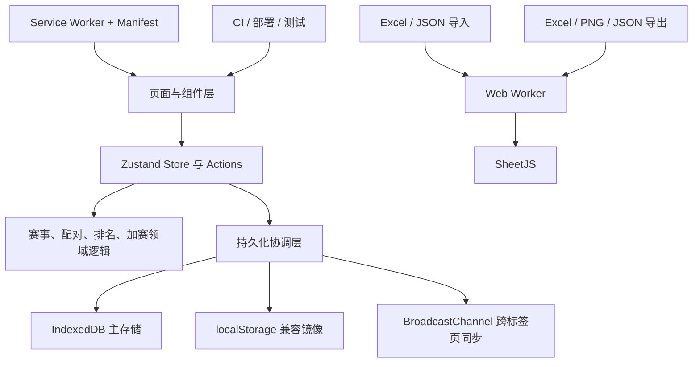
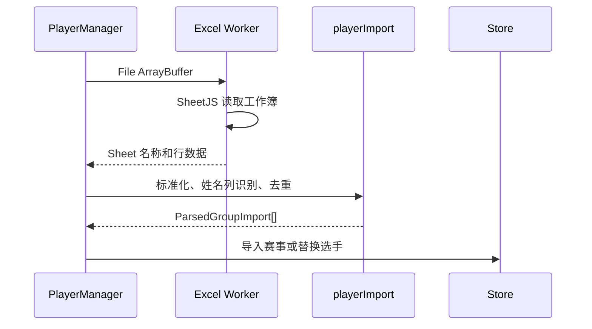

# 技术架构

## 1. 架构目标

- 保持纯前端、本地优先和静态部署能力。
- 将赛事规则、持久化、导入导出和 UI 解耦。
- 在大型赛事和高频写入下保持数据一致性。
- 支持离线 PWA、中英双语、浏览器自动化和可维护发布流程。

## 2. 技术栈

| 领域 | 技术 |
|------|------|
| UI | React 18 |
| 语言 | TypeScript 5，开启严格模式 |
| 构建 | Vite 6 |
| 样式 | Tailwind CSS 3 |
| 状态 | Zustand 5 |
| 路由 | React Router 7 |
| PWA | vite-plugin-pwa + Workbox |
| 多标签协调 | Web Locks + BroadcastChannel |
| Excel | SheetJS 官方安全版 0.20.3 |
| 图片导出 | html2canvas |
| 图标 | Lucide React |
| 测试 | Vitest 5 + Playwright Core |
| 视觉回归 | pixelmatch + pngjs |
| 部署 | GitHub Actions + GitHub Pages |

## 3. 分层架构



### 3.1 UI 层

组件按领域分目录：

```text
src/components/
├── common/       # Header、ConfirmDialog、ErrorBoundary、StorageBanner
├── competition/  # ControlPanel、GroupTabs、RoundTabs、PlayoffPanel
├── players/      # PlayerManager、DropoutManager、PlayerRanking、PlayerPreviewModal
├── matches/      # MatchList、MatchImageView、ResultButtons、RoundEditor
├── export/       # Excel/Image 导出弹窗和导出预览
├── data/         # BackupManager
└── help/         # HelpPage
```

UI 组件不直接实现评分和配对算法，只负责交互、格式化展示和调用 Store / 工具函数。

### 3.2 状态层

主 Store 位于 `src/store/useTournamentStore.ts`，保存：

- 当前赛事 `TournamentCompetition`
- 当前查看轮次
- 随机生成状态与进度
- 最多 30 个操作的历史快照和撤销/重做游标
- 单写者锁状态与只读标记
- 所有赛事、小组、选手、对阵和加赛动作

赛事生命周期动作拆分在：

```text
src/store/actions/
├── competitionActions.ts
└── snapshotActions.ts
```

其他纯状态变更仍由 `competitionState`、`gameFlow`、`roundActions` 和多个 Mutator 模块提供。

### 3.3 领域逻辑层

- `utils/swissPairing.ts`：瑞士轮、单败淘汰、排名和评分核心。
- `utils/tiebreak.ts`：破分链预设、归一化和自定义规则。
- `utils/storage/health.ts`：存储完整性检查、主备镜像比对和安全重写修复。
- `utils/ranking.ts`：淘汰头衔、比赛历史和展示辅助。
- `utils/playoffs.ts`：同分加赛流程。
- `utils/maximumMatching.ts`：配对回溯辅助。

领域函数优先保持纯函数，便于单元测试和大规模组合验证。

## 4. 数据模型

数据层级为：

```text
TournamentCompetition
└── TournamentGroup[]
    ├── Player[]
    └── Match[]
        └── PlayoffBracket? 关联加赛
```

### 4.1 核心类型

- `TournamentCompetition`：赛事名称、小组数组、当前小组索引。
- `TournamentGroup`：状态、轮次、赛制、局制、选手和对阵。
- `Player`：战绩、排名指标、弃赛/淘汰状态、上下匹配优先级和加赛信息。
- `Match`：轮次、双方、结果、比分、轮空、赛前弃赛和加赛字段。

### 4.2 Schema 校验

`src/utils/schema.ts` 对导入和持久化数据执行运行时校验：

- 校验顶层赛事、小组、选手和对阵字段。
- 校验赛制、局制、状态、结果和加赛枚举。
- 拒绝非数组、错误类型和非法枚举值。
- 提供字段路径错误，最多返回前 8 条。
- 用于 JSON 导入和 IndexedDB/localStorage 加载。

## 5. 存储架构

### 5.1 IndexedDB 主存储

`src/utils/storage/indexedDb.ts` 提供通用键值 API：

- `idbGet`
- `idbSet`
- `idbDelete`
- `isIndexedDbAvailable`

赛事数据和快照优先写入 IndexedDB。

### 5.2 localStorage 兼容层

- 小型数据同时保留 localStorage 镜像。
- IndexedDB 不可用时作为主回退。
- 旧版本 localStorage 数据会在加载后迁移到 IndexedDB。
- 主 key 损坏时尝试备份 key。

### 5.3 写入一致性

- 所有 IDB 写入进入串行 Promise 队列。
- 旧写入无法晚于新写入覆盖最新状态。
- localStorage 镜像同步写入，提高页面消失前的可靠性。
- 保存事件通过自定义事件和 BroadcastChannel 广播。

### 5.4 快照

- 每轮完赛自动创建，最多保留 5 份。
- 恢复时重新计算胜率和排名。
- IDB 优先，小型快照保留 localStorage 副本。

### 5.5 跨标签页同步

`storageSync.ts` 负责：

- 广播保存时间和来源标签页。
- 其他标签页自动重新加载最新赛事。
- 2 秒内检测到双方写入时显示冲突提示。
- 支持 Web Locks 时启用单写者模式，其他标签页保持只读；不支持时回退到冲突提示。

## 6. 导入与导出

### 6.1 Excel / CSV / TXT 导入



Worker 负责 SheetJS 读取，主线程不直接加载 xlsx 库。

### 6.2 Excel 导出

`utils/export/excelWorkbook.ts`：

1. 将工作表数据发送给 Worker。
2. Worker 使用 SheetJS 生成工作簿。
3. Worker 按工作表回传构建进度。
4. 返回可转移的 ArrayBuffer；取消操作会终止 Worker。
5. 主线程创建 Blob 并触发下载。

### 6.3 图片与 JSON

- 图片使用 `html2canvas` 绘制，导出前按需加载。
- PNG 编码优先交给 OffscreenCanvas Worker，主线程只处理 DOM 截图和下载。
- 图片批量导出显示总体进度，并可在当前文件完成后立即取消。
- JSON 使用原生 Blob 和 FileReader。
- JSON 导入必须先通过 Schema 校验。

## 7. PWA 与离线

- `public/site.webmanifest` 定义应用名称、颜色和图标。
- `vite-plugin-pwa` 生成 `sw.js` 和 Workbox 运行时。
- 预缓存 HTML、JS、CSS、SVG、PNG 和 manifest。
- `registerType: prompt` 发现新版本后等待用户确认，再激活更新。
- 离线测试通过 Playwright 断网后刷新验证。

## 8. 目录结构

```text
src/
├── components/
│   ├── common/
│   ├── competition/
│   ├── data/
│   ├── export/
│   ├── help/
│   ├── matches/
│   └── players/
├── hooks/
│   ├── useEscapeClose.ts
│   ├── useFocusTrap.ts
│   ├── usePwaUpdate.ts
│   ├── useStorageSync.ts
│   └── useTheme.ts
├── i18n/
│   ├── context.ts
│   ├── data.ts
│   ├── data.test.ts
│   └── index.tsx
├── pages/Home.tsx
├── store/
│   ├── actions/
│   └── ...
├── types/index.ts
├── utils/
│   ├── export/
│   ├── import/
│   ├── storage/
│   ├── async.ts
│   ├── auditLog.ts
│   ├── errorReport.ts
│   ├── schema.ts
│   ├── playoffs.ts
│   ├── ranking.ts
│   └── swissPairing.ts
├── workers/
│   ├── excelWorker.ts
│   └── imageWorker.ts
├── App.tsx
└── main.tsx
```

## 9. 配对与排名

### 9.1 瑞士轮

1. 首轮随机配对。
2. 后续按胜场分组。
3. 组内优先对折匹配。
4. 对折失败时使用回溯穷举。
5. 奇数或无法内部配对时进入下移组。
6. 优先使用上下匹配标记、次数和排名规则。
7. 最终无法匹配的选手轮空。

### 9.2 单败淘汰

- 首轮随机，后续按上轮胜者顺序。
- 败者淘汰。
- 奇数晋级者产生轮空。
- 当前轮支持手动编辑。

### 9.3 排名

瑞士轮默认顺序：

```text
活跃状态 → 胜率/胜场 → 对手胜率 → 局胜率或 SOSOS → 其他破分 → 姓名
```

破分链支持 BO1 / 多局标准预设及自定义排序，并统一用于排名、配对、平分检测、加赛与导出。

单败淘汰：

```text
存活轮次 → 胜场 → 败场 → 姓名
```

## 10. 测试与质量

| 类型 | 工具 | 覆盖 |
|------|------|------|
| 单元测试 | Vitest | 配对、评分、加赛、存储、国际化、Excel 数据 |
| 覆盖率门槛 | Vitest V8 | 语句、分支、函数和行覆盖率最低阈值 |
| 浏览器流程 | Playwright Core | Excel 导入、开赛、Excel 导出、刷新恢复、语言切换 |
| 离线测试 | Playwright + Preview | Service Worker 缓存后断网打开 |
| 视觉回归 | pixelmatch + pngjs | HelpPage 基线截图 |
| 类型检查 | TypeScript strict | 全项目 |
| Lint | ESLint | 全项目 |
| Bundle 预算 | 自定义脚本 | 主包、最大资源和总 gzip |
| 安全 | npm audit | 全依赖 |

## 11. CI 与部署

CI 流程：

1. `npm ci`
2. `npm run check`
3. `npm run lint`
4. `npm run test:coverage`
5. `npm run smoke`
6. `npm run build`
7. `npm run check:bundle`
8. `npm run smoke:offline`
9. `npm run visual:check`

部署工作流在 `main` 推送后执行相同构建、体积和离线检查，再将 `dist/` 上传到 GitHub Pages。

## 12. 安全与风险

- SheetJS 使用官方安全版本，避免 npm registry 旧版漏洞。
- `npm audit` 当前为 0 漏洞。
- 无后端、无账号、无远程数据上传。
- 主要剩余风险是浏览器数据被用户主动清除，以及浏览器不支持 Web Locks 时的并发兼容差异。
- 建议长期保持 JSON 备份，并在正式比赛前用测试模式模拟完整赛程。
